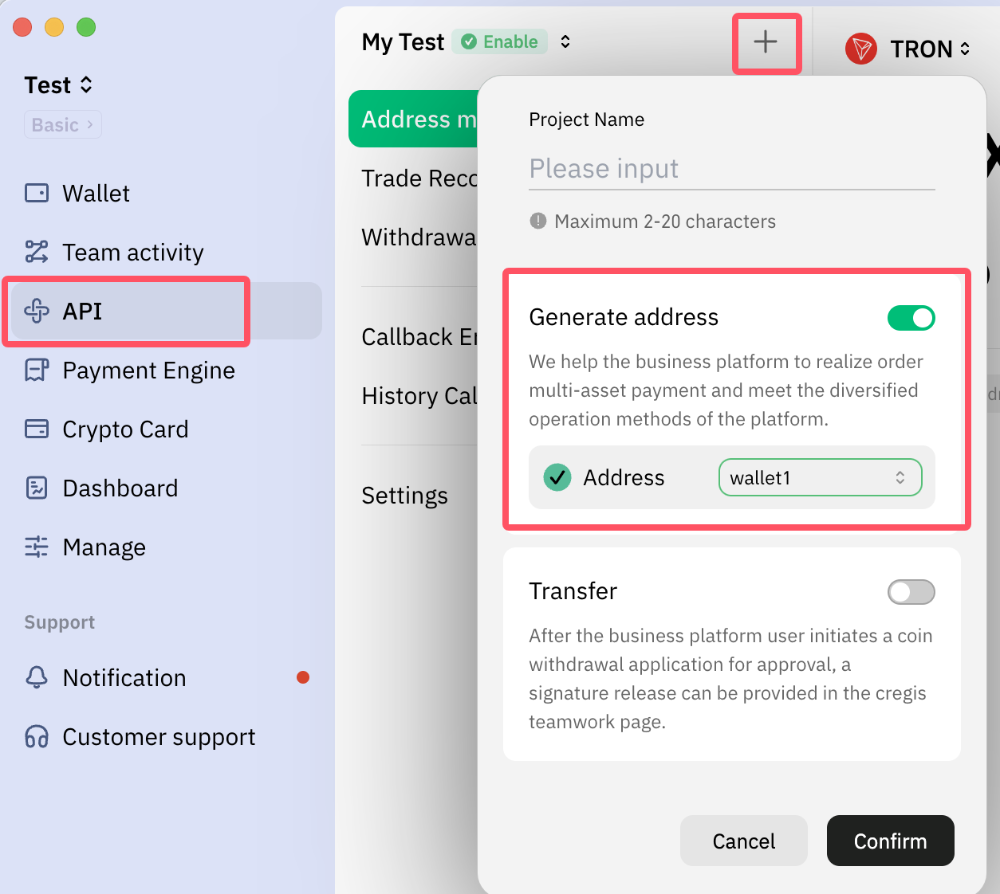
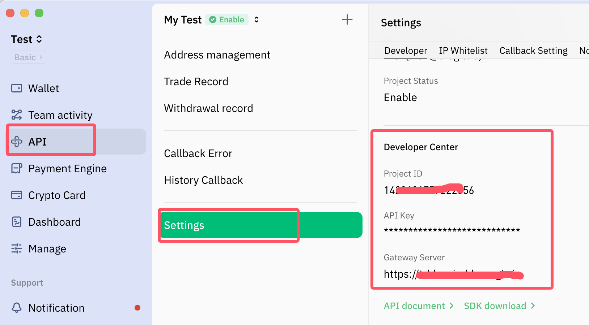
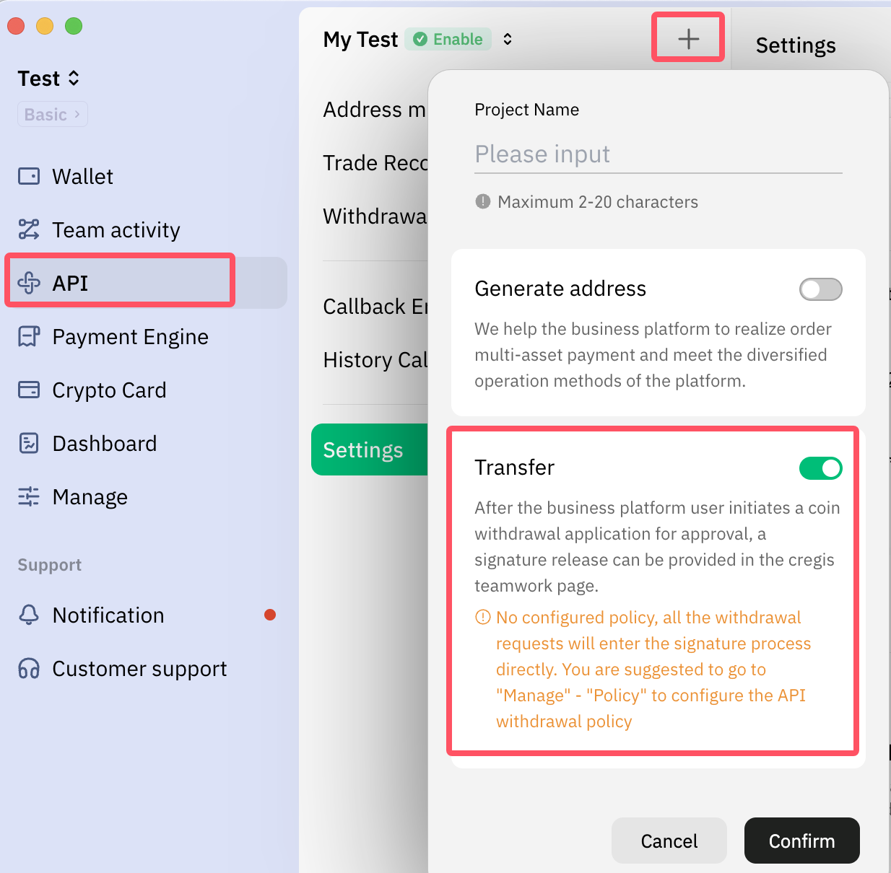

## Description

The project API supports creating addresses for deposit and withdrawal, which is commonly used for deposit and withdrawal management of users on exchanges and other platforms.  

### _Address deposit_

> A new address will be generated for each successful call, which can be called when the user successfully registers. The generated address will be set as the user's fixed recharge address. When the on-chain recharge notification of the address is received, the user will be recharged.
> Note: EVM type addresses can share the same address, for example: USDT-BEP20 and USDT-ERC20 can both use ETH addresses for recharge

1、Create wallet  
2、Create a project and select 'Generate address'

    

3、Get API key and other developer information

    

### _Withdrawal_

> The platform user calls this API when withdrawing funds. The transaction will be signed in the CREGIS wallet and then uploaded to the blockchain. The user's funds in the platform can be deducted based on the actual result notification after the transaction is uploaded to the blockchain.

1、Policy settings (optional)，<a href='https://support.cregis.com/risk-management/policy-engine' target="_blank">Understand the strategy</a>  
2、Create a project and select ‘Transfer‘

    

3、Get API key and other developer information

    

