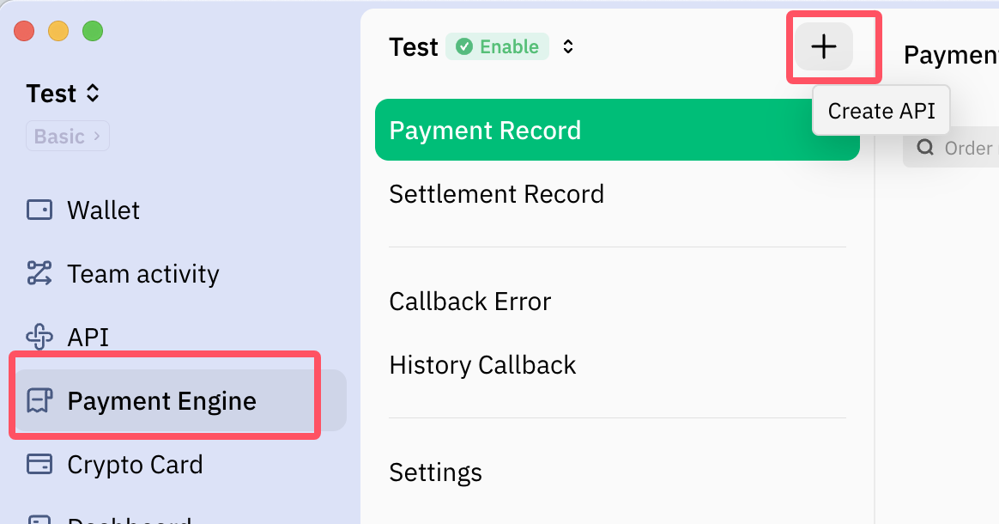
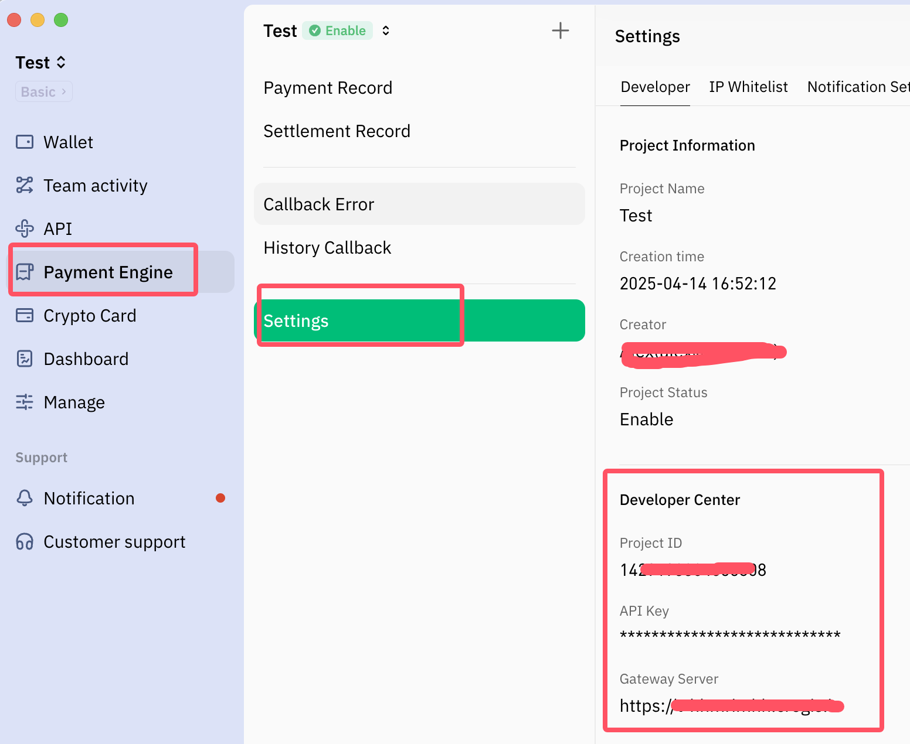

## Description

The payment engine API provides encrypted payment solutions.Merchants can quickly implement payment collection business through the API interface without having to maintain the payment address, address fund collection, etc. After the interface is successfully called, you can use the cash register provided by CREGIS directly, or you can design the collection process interface according to your needs.<a href='https://support.cregis.com/payment-engine/introduction' target='_blank'>Learn more</a>

## Process list
1、Create wallet to set the settlement payment address  
2、Create a project in the 'Payment Engine'

    

3、Get API key and other developer information

    

